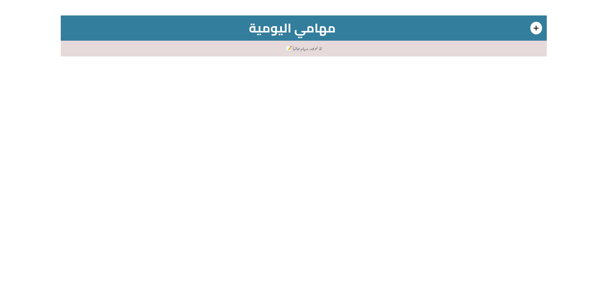
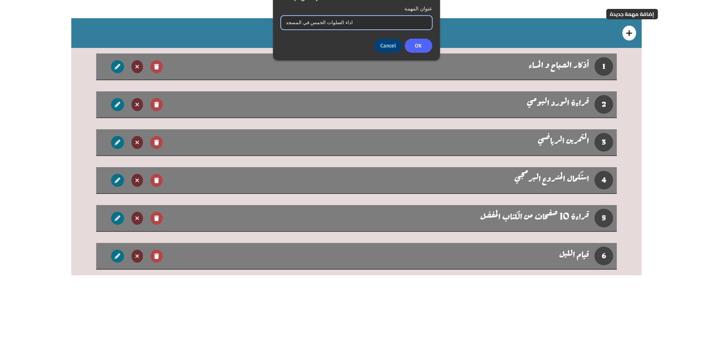
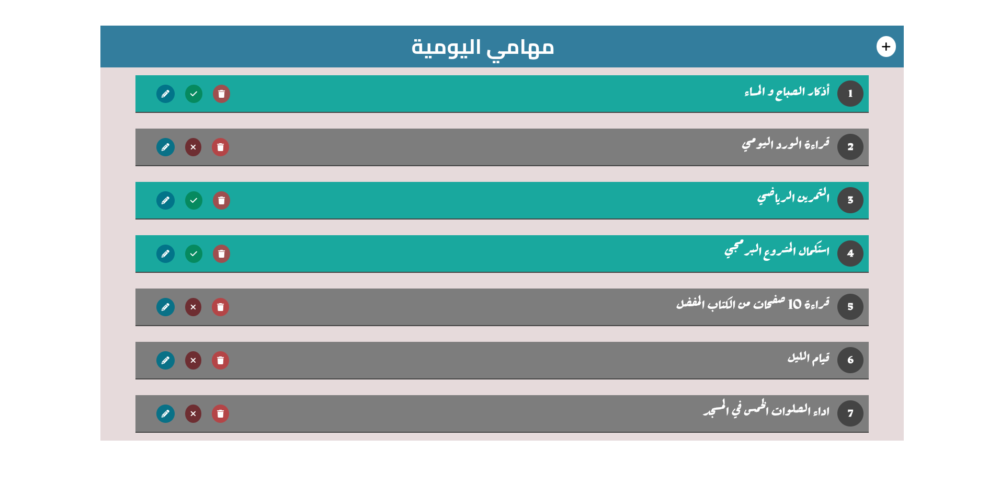
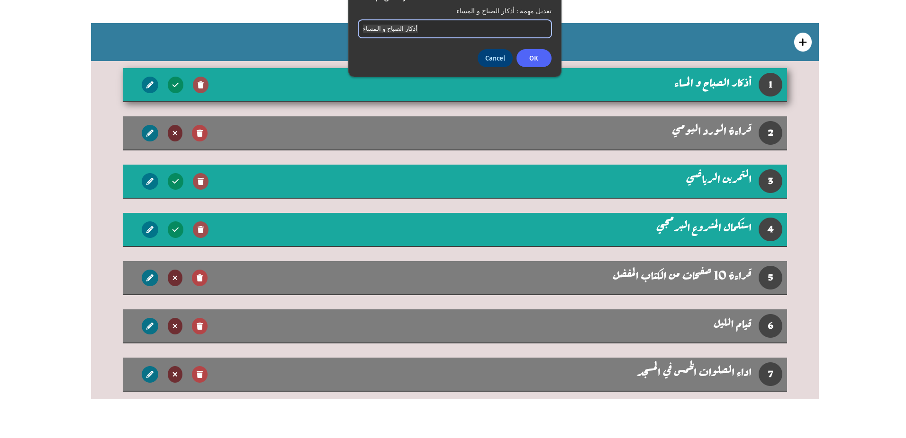
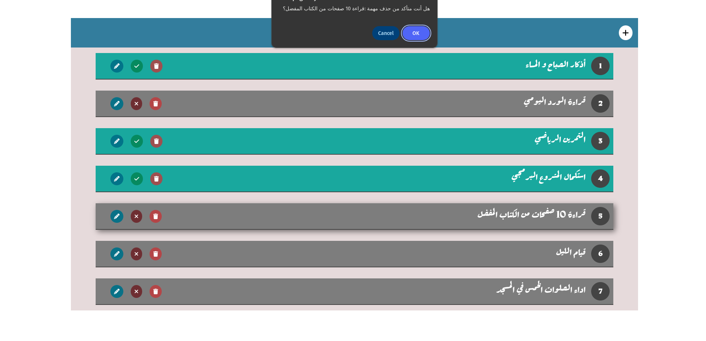

# 📝 Daily To-Do List App

A simple and elegant daily to-do list web application built with HTML, CSS, and JavaScript.  
It allows users to add, delete, edit, and mark tasks as completed — helping them stay productive and organized throughout the day.

🚀 **Live Demo**:  
[👉 Try the App](https://cheerful-gingersnap-1fb94f.netlify.app/)

---

## ✨ Features

- ✅ Add new tasks with a click  
- 📝 Edit existing tasks  
- ❌ Delete tasks you no longer need  
- ✔️ Mark tasks as done or undone  
- 💾 Data saved in localStorage (persists after reload)  
- 🎨 Smooth UI with transitions and modern styling  
- 📅 Clean and responsive layout for daily productivity  

---

## 🛠️ Built With

- HTML5  
- CSS3 (Flexbox + Transitions)  
- Vanilla JavaScript (no frameworks)  

---

## 📸 App Screenshots

### 1️⃣ No Tasks Yet  
When the app has no tasks, a friendly message is shown:  


---

### 2️⃣ Adding a New Task  
Easily add tasks using the "+" icon:  


---

### 3️⃣ Some Tasks Completed  
Tasks can be marked as done with a visual highlight:  


---

### 4️⃣ Editing a Task  
You can modify any task title at any time:  


---

### 5️⃣ Deleting a Task  
Remove tasks instantly using the trash icon:  


---

## 🧪 Run Locally

1. Clone the repository:
   ```bash
   git clone https://github.com/ahmdamir/Daily-To-Do-List-App.git
   cd Daily-To-Do-List-App
   
2. Navigate to the project folder and open index.html in your browser:


## 👨‍💻 Author

Made with ❤️ by [Ahmed Amir](https://github.com/ahmdamir)

- 🔗 GitHub: [@ahmdamir](https://github.com/ahmdamir)  
- 🌐 Live App: [cheerful-gingersnap-1fb94f.netlify.app](https://cheerful-gingersnap-1fb94f.netlify.app/)  
- 📧 Email: ahmdamir.dev@gmail.com
